# Workflow Diagram

## Complete Simulation Workflow

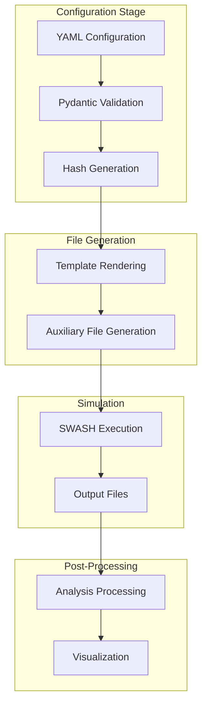

## Detailed File Flow

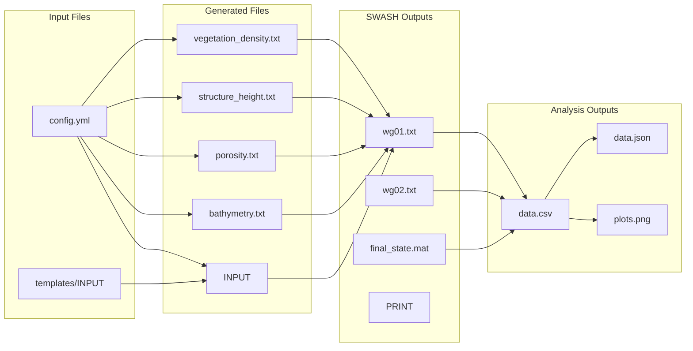

## Configuration Processing

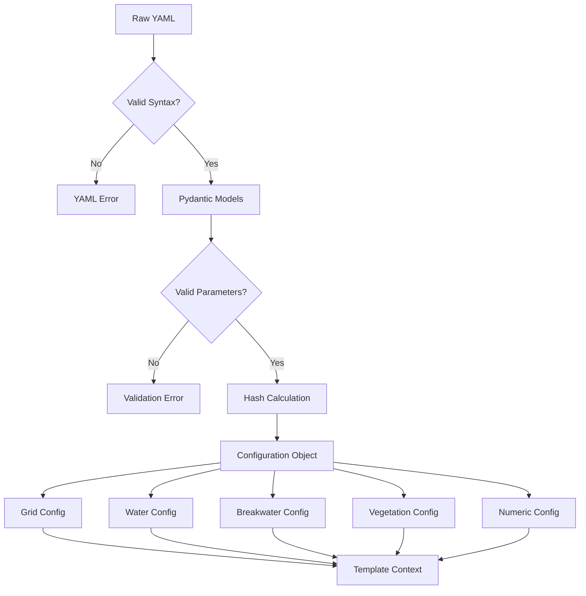

## Template Rendering Process

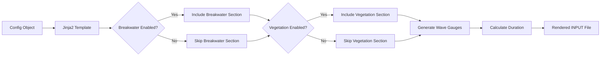

## SWASH Execution Flow

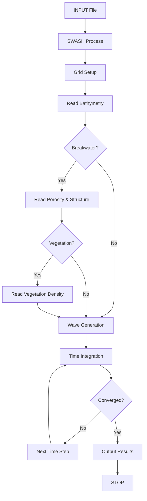

## Analysis Pipeline

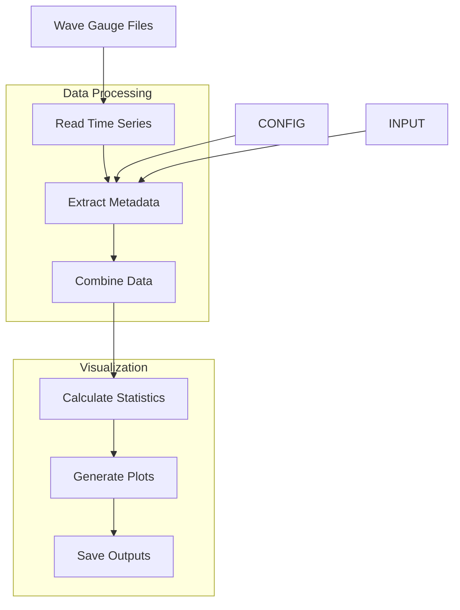

## Error Handling Flow

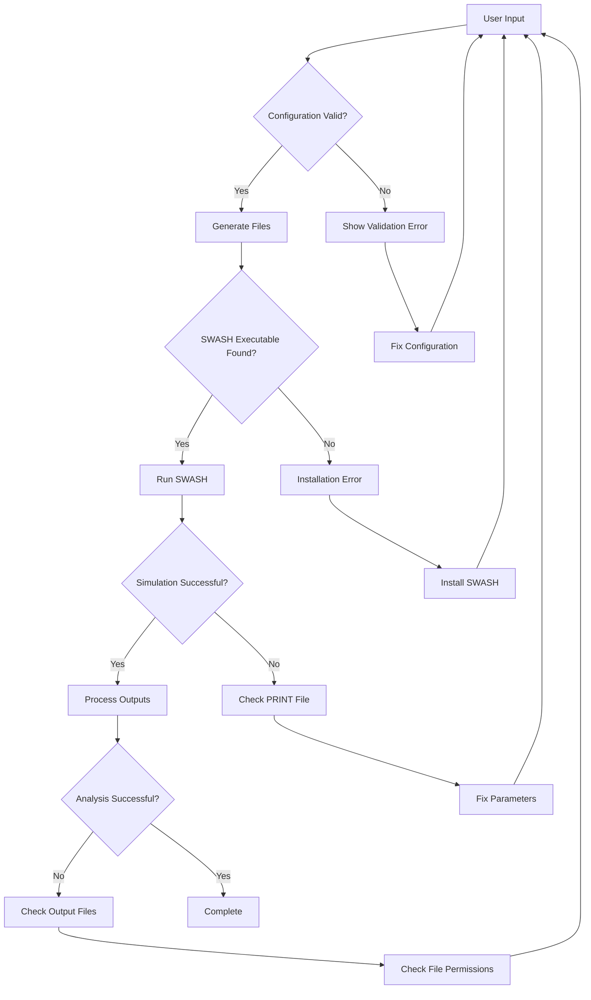

## CLI Command Flow

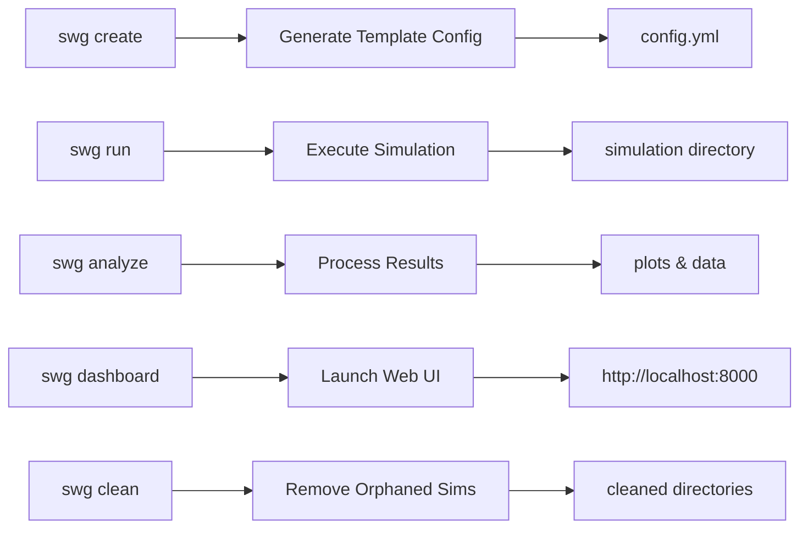

## Data Transformation Chain

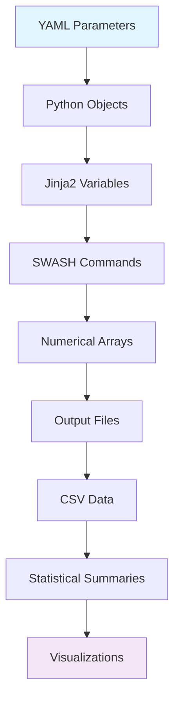

## Physical Process Representation

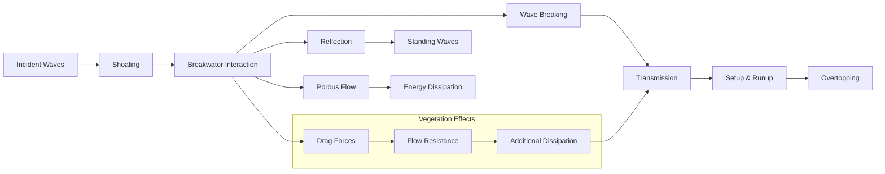

## File Dependencies

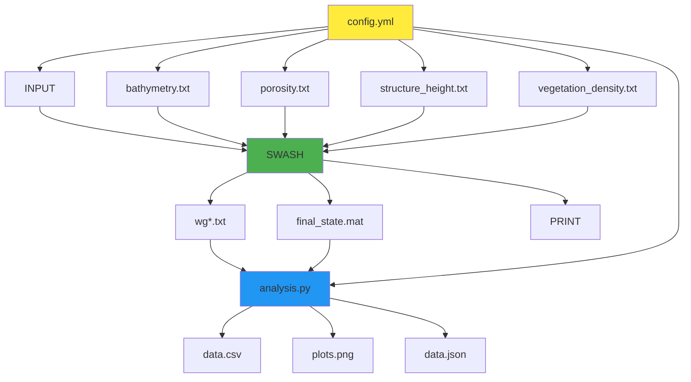

## Simulation States

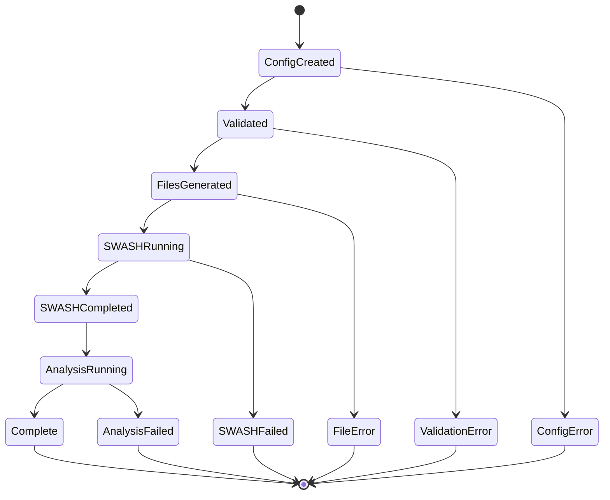