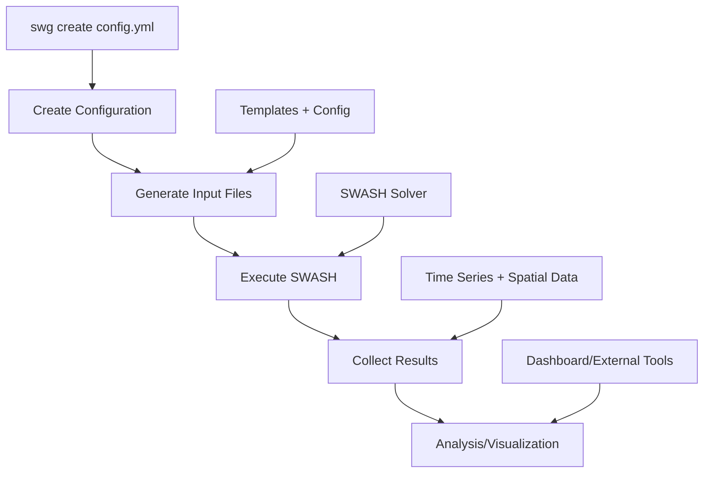

# Simulation Workflow and CLI Usage

## Overview

This document describes the complete workflow for running SWASH breakwater simulations using the framework's command-line interface (CLI). The workflow includes configuration creation, simulation execution, and result management.

## Command Line Interface

The framework provides a simple CLI with shorthand commands for common operations:

### Available Commands

| Command | Shorthand | Purpose |
|---------|-----------|---------|
| `swg create` | `swg c` | Create or update configuration files |
| `swg run` | `swg r` | Run simulations from configuration files |
| `swg dashboard` | `swg d` | Launch interactive web dashboard |

### Installation and Setup

The CLI is installed as `swg` (SWASH-GUI) and available after installation:

```bash
# Install the package (in development mode)
pip install -e .

# Or using uv (recommended)
uv sync

# Verify installation
swg --help
```

## Workflow Overview



## Step-by-Step Workflow

### 1. Configuration Creation

#### Create New Configuration
```bash
# Create a new configuration file with defaults
swg create config/my_experiment.yml

# Create multiple configurations
swg create config/test1.yml config/test2.yml config/test3.yml

# Shorthand
swg c config/wave_study.yml
```

**What happens:**
- Creates YAML file with default parameters
- Adds descriptive comments for each parameter
- Generates unique configuration hash
- File can be edited with any text editor

#### Example Generated Configuration
```yaml
hash: 58ab2fe7  # hash of the config (automatically modified)
grid: # computational grid configuration
  hash: f144f5d3  # hash of the config (automatically modified)
  length: 112.0 # length of the computational domain (m)
  nx_cells: 500 # number of cells in x-direction
  n_layers: 2 # number of vertical layers (2-3 recommended)
breakwater: # configuration for the breakwater
  # ... additional parameters with comments
```

#### Update Existing Configuration
```bash
# Update configuration (recalculates hashes)
swg create config/existing.yml
```

**When to update:**
- After manual parameter changes
- To refresh configuration hashes
- To add new default parameters

### 2. Configuration Editing

#### Manual Editing
```bash
# Edit with any text editor
nano config/my_experiment.yml
vim config/my_experiment.yml
code config/my_experiment.yml
```

#### Parameter Modification Examples
```yaml
# Modify wave conditions
water:
  wave_height: 0.8      # Increase wave height
  wave_period: 8.0      # Longer period

# Adjust breakwater geometry  
breakwater:
  crest_height: 2.5     # Higher crest
  porosity: 0.3         # Lower porosity

# Enable vegetation
vegetation:
  enable: true          # Turn on vegetation
  plant_density: 15.0   # Denser vegetation

# Extend simulation
numeric:
  n_waves: 100          # More waves
  output_interval: 0.05 # Higher frequency output
```

### 3. Simulation Execution

#### Single Simulation
```bash
# Run single simulation
swg run config/my_experiment.yml

# Using shorthand
swg r config/test.yml
```

#### Batch Processing
```bash
# Run multiple configurations
swg run config/test1.yml config/test2.yml config/test3.yml

# Use glob patterns for parameter studies
swg run config/wave_*.yml
swg run config/vegetation_study_*.yml

# Run all configurations in directory
swg run config/
```

#### Advanced Patterns
```bash
# Complex glob patterns
swg run config/*_h0[5-8]*.yml    # Wave heights 0.5-0.8
swg run config/scenario_[12]*.yml # Scenarios 1 and 2

# Recursive search
swg run studies/                  # All .yml files in studies/
```

## Execution Process

### Phase 1: File Generation

When `swg run` is executed, the framework:

#### 1. Configuration Processing
```bash
[*] Running simulation my_experiment...
```
- Reads and validates YAML configuration
- Calculates configuration hash
- Updates configuration file with new hash

#### 2. Directory Creation
```
simulations/my_experiment_58ab2fe7/
```
- Creates unique directory: `{name}_{hash}`
- Hash ensures reproducibility
- Multiple runs with same config use same directory

#### 3. Data File Generation
```bash
# Generated files
simulations/my_experiment_58ab2fe7/
├── bathymetry.dat          # Bottom elevations
├── porosity.dat            # Porosity field
├── structure_height.dat    # Structure height
├── vegetation_density.dat  # Vegetation (if enabled)
└── INPUT                   # SWASH input file
```

**File generation process:**
- **bathymetry.dat**: Flat bottom at z=0.0
- **porosity.dat**: 0.0 (water), breakwater.porosity (structure)
- **structure_height.dat**: 0.0 (water), crest_height (structure)
- **vegetation_density.dat**: 0.0 (water/slopes), plant_density (crest only)
- **INPUT**: Jinja2 template rendering with configuration parameters

### Phase 2: SWASH Execution

#### 1. Error File Cleanup
```python
# Remove existing error files for clean reporting
errfile_path = simulation_dir / "Errfile"
if errfile_path.exists():
    errfile_path.unlink()
```

#### 2. SWASH Process Launch
```bash
[*] Executing SWASH simulation...
```

**Process details:**
- **Command**: `swash` (assumes SWASH in PATH)
- **Working directory**: Simulation directory
- **Timeout**: 1 hour maximum
- **Capture**: stdout, stderr, return code

#### 3. Error Checking
The framework checks multiple sources for errors:

**Errfile Analysis:**
```python
# Check for runtime errors
errfile_path = simulation_dir / "Errfile"
if errfile_path.exists() and errfile_content:
    errors.append(f"Errfile: {errfile_content}")
```

**PRINT File Analysis:**
```python
# Scan PRINT file for error messages
for i, line in enumerate(lines, 1):
    if "** Severe error" in line or "** Error" in line:
        errors.append(f"PRINT line {i}: {error_msg}")
```

#### 4. Success/Failure Reporting
```bash
# Success
[+] SWASH simulation completed successfully

# Failure  
[!] SWASH simulation failed with 2 error(s)
  [!]   Errfile: Wrong type of data for variable NSTEMS
  [!]   PRINT line 116: Error: Wrong type of data for variable NSTEMS
```

### Phase 3: Result Collection

#### Generated Output Files
```bash
simulations/my_experiment_58ab2fe7/
├── INPUT                    # SWASH input (generated)
├── PRINT                    # SWASH log file  
├── bathymetry.dat          # Input data files
├── porosity.dat
├── structure_height.dat
├── wg01.dat                # Wave gauge time series
├── wg02.dat
├── wg03.dat
├── wg04.dat
├── wg05.dat
├── final_state.mat         # Spatial output (MATLAB format)
├── norm_end                # Simulation end status
└── swashinit               # SWASH initialization file
```

#### Output File Descriptions

**Time Series (`wg*.dat`)**:
- **Format**: ASCII, space-separated
- **Columns**: Time, Water level, U-velocity, V-velocity
- **Frequency**: Controlled by `numeric.output_interval`
- **Locations**: From `numeric.wave_gauge_positions`

**Spatial Output (`final_state.mat`)**:
- **Format**: MATLAB binary
- **Variables**: WATLEV, VEL, HSIG, SETUP
- **Grid**: Every 4th computational cell
- **Time**: Final time step

**Log Files**:
- **PRINT**: Complete SWASH execution log
- **Errfile**: Runtime errors (if any)
- **norm_end**: Numerical convergence information

## Parametric Studies

### Systematic Parameter Variation

#### 1. Create Base Configuration
```bash
swg create config/base.yml
```

#### 2. Create Variations
```bash
# Manual variations for wave height study
cp config/base.yml config/wave_h05.yml
cp config/base.yml config/wave_h08.yml 
cp config/base.yml config/wave_h12.yml

# Edit each file to modify wave_height parameter
```

#### 3. Batch Execution
```bash
# Run all wave height variations
swg run config/wave_*.yml
```

### Automated Parameter Studies

#### Script-Based Generation
```python
# Python script for parameter generation
import yaml
from pathlib import Path

base_config = yaml.safe_load(Path("config/base.yml").read_text())

# Wave height study
wave_heights = [0.5, 0.6, 0.7, 0.8, 0.9, 1.0]
for h in wave_heights:
    config = base_config.copy()
    config['water']['wave_height'] = h
    
    output_file = f"config/wave_h{h:02.0f}.yml"
    Path(output_file).write_text(yaml.dump(config))
```

#### Vegetation Study Example
```bash
# Create configurations for vegetation study
swg create config/veg_off.yml      # vegetation.enable: false
swg create config/veg_low.yml      # plant_density: 5
swg create config/veg_med.yml      # plant_density: 10  
swg create config/veg_high.yml     # plant_density: 20

# Run vegetation study
swg run config/veg_*.yml
```

## Result Management

### Directory Structure
```
simulations/
├── base_a1b2c3d4/          # Hash-based naming
│   ├── INPUT
│   ├── PRINT
│   ├── wg*.dat
│   └── final_state.mat
├── wave_h05_e5f6g7h8/
├── wave_h08_i9j0k1l2/
└── ...
```

### Result Organization Best Practices

#### 1. Meaningful Configuration Names
```bash
# Good naming convention
config/storm_scenario_1.yml       # Clear purpose
config/veg_summer_dense.yml       # Descriptive parameters
config/prototype_validation.yml   # Application context

# Poor naming
config/test1.yml                  # Unclear purpose
config/config.yml                 # Generic name
```

#### 2. Documentation
```bash
# Create study documentation
echo "Wave height parametric study" > studies/wave_study/README.md
echo "Testing H = 0.5, 0.6, 0.7, 0.8 m" >> studies/wave_study/README.md

# Include parameter ranges
echo "Configurations:" >> studies/wave_study/README.md
ls studies/wave_study/*.yml >> studies/wave_study/README.md
```

#### 3. Result Backup
```bash
# Archive completed studies
tar -czf results_wave_study_$(date +%Y%m%d).tar.gz simulations/wave_*

# Version control configurations
git add config/
git commit -m "Add wave height parametric study configurations"
```

## Dashboard Interface

### Launching Dashboard
```bash
# Start interactive dashboard
swg dashboard

# Or using shorthand
swg d
```

**Dashboard features** (in development):
- **Configuration editor**: Visual parameter adjustment
- **Simulation monitoring**: Real-time execution status
- **Result visualization**: Time series and spatial plots
- **Comparison tools**: Multi-simulation analysis

## Performance Considerations

### Simulation Speed

**Factors affecting performance:**
- **Grid resolution**: Higher `nx_cells` = longer runtime
- **Vertical layers**: More `n_layers` = longer runtime
- **Simulation duration**: More `n_waves` = longer runtime
- **Output frequency**: Lower `output_interval` = more I/O

**Optimization strategies:**
```yaml
# Fast simulation for testing
grid:
  nx_cells: 200            # Coarser grid
  n_layers: 2              # Minimum layers

numeric:
  n_waves: 20              # Fewer waves
  output_interval: 0.2     # Less frequent output

# Production simulation
grid:
  nx_cells: 1000           # Fine grid
  n_layers: 3              # Better vertical resolution

numeric:
  n_waves: 100             # Longer duration
  output_interval: 0.05    # High frequency output
```

### Parallel Execution

**Multiple simulations can run simultaneously:**
```bash
# Terminal 1
swg run config/study1_*.yml

# Terminal 2
swg run config/study2_*.yml

# Or using background processes
swg run config/batch1_*.yml &
swg run config/batch2_*.yml &
wait  # Wait for all to complete
```

## Troubleshooting Workflow Issues

### Common Execution Problems

#### 1. SWASH Not Found
```bash
Error: SWASH executable not found
```
**Solution**: Ensure SWASH is installed and in PATH
```bash
which swash                # Check SWASH location
export PATH=$PATH:/path/to/swash  # Add to PATH if needed
```

#### 2. Configuration Errors
```bash
Error: Invalid configuration file
```
**Solution**: Check YAML syntax and parameter types
```bash
# Validate YAML syntax
python -c "import yaml; yaml.safe_load(open('config/test.yml'))"

# Update configuration to fix validation
swg create config/test.yml
```

#### 3. Permission Issues
```bash
Error: Permission denied creating simulation directory
```
**Solution**: Check write permissions
```bash
chmod 755 simulations/     # Ensure write access
mkdir -p simulations/      # Create directory if needed
```

#### 4. Disk Space Issues
```bash
Error: No space left on device
```
**Solution**: Clean old simulations or increase storage
```bash
# Check disk usage
df -h .

# Clean old simulation directories
rm -rf simulations/old_*

# Archive important results
tar -czf archive.tar.gz simulations/important_*
```

## Next Steps

- **[Configuration Guide](configuration-guide.md)**: Learn to modify simulation parameters
- **[Input File Reference](input-file-reference.md)**: Understand generated SWASH inputs
- **[Output Reference](output-reference.md)**: Interpret simulation results
- **[Physics and Parameters](physics-and-parameters.md)**: Understand the physical meaning
- **[Troubleshooting](troubleshooting.md)**: Solutions for common issues